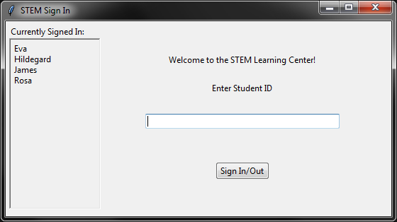
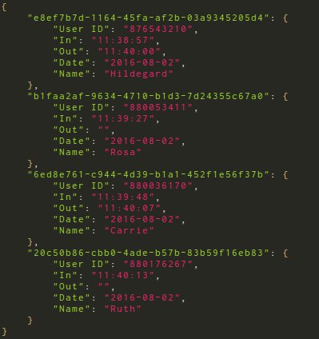

Chronophore
===========

Chronophore is a simple time-tracking program. It keeps track of users' hours as they sign in and out. Data is stored in a human-readable json file. 

This project was started to help keep track of students signing in and out at a tutoring program in a community college, but should be adaptable to other use cases.

To Do
-----
- Basic Features:
    - [x] Write to and read from a json file
    - [x] Format json output with nested keys
    - [x] Generate uuid indices for entries
    - [x] Keep track of which users are signed in
    - [x] Logging
    - [x] Tkinter gui
    - [x] Organize data files in date-based hierarchy
    - [x] Load or create data file on startup based on current date
    - [x] Validate user input
        - [x] Basic user id validation
        - [x] Student registry json file
        - [x] Check whether student is registered
        - [x] Handle invalid json files
    - [ ] Package to be a portable windows executable

- Further Improvements:
    - [x] JSON to spreadsheet converter
    - [x] Convert unit tests to pytest syntax
    - [x] Configuration file
    - [x] Come up with a name no one else is using (Chronophore)
    - [ ] Check for bad entries from previous days
    - [ ] Flag students that forgot to sign out
    - [ ] Documentation
    - [ ] Access database over local wireless network
    - [ ] Admin UI
    - [ ] Encrypt/decrypt database
    - [ ] Change unit tests to use [file-like objects](http://stackoverflow.com/questions/3942820/how-to-do-unit-testing-of-functions-writing-files-using-python-unittest) instead of files
